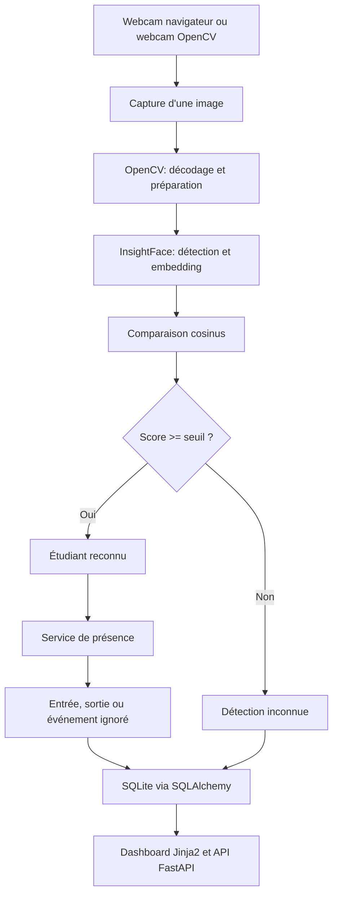

# Synthèse du projet J-Presence

## 1. Identité du projet

**J-Presence** est une application de gestion numérique des entrées et sorties des étudiants dans un laboratoire informatique. Elle remplace un journal papier par un système capable d'identifier un étudiant à partir de son visage, d'enregistrer son arrivée et son départ, puis de présenter l'historique dans une interface web.

Le projet est conçu pour fonctionner localement avec une webcam, une base SQLite et un modèle de reconnaissance faciale exécuté sur le processeur.

## 2. Objectifs

Le projet cherche à :

- enregistrer le profil d'un étudiant et plusieurs captures de son visage ;
- produire un embedding facial de référence ;
- reconnaître les étudiants déjà enregistrés ;
- enregistrer automatiquement une entrée puis une sortie ;
- éviter les doublons causés par les images successives d'une caméra ;
- conserver les détections inconnues pour consultation ;
- offrir une interface simple pour le journal et les étudiants ;
- fournir une API réutilisable pour les scripts, les notebooks et le frontend.

## 3. Fonctionnement global



## 4. Parcours d'inscription d'un étudiant

1. L'opérateur ouvre la page **Etudiants**.
2. Il renseigne le nom, la promotion, le laboratoire, la machine et éventuellement le téléphone.
3. Il prend une à trois captures avec la webcam ou sélectionne des photos.
4. Chaque capture doit contenir exactement un visage.
5. InsightFace génère un embedding pour chaque capture.
6. Les embeddings sont normalisés, moyennés, puis normalisés une seconde fois.
7. Le profil et l'embedding final sont enregistrés dans la table `students`.

La logique est principalement portée par [src/face/registration.py](../src/face/registration.py), avec les données validées par [app/schemas.py](../app/schemas.py).

## 5. Parcours de reconnaissance et de présence

1. Le navigateur démarre la caméra et capture une image environ toutes les 700 millisecondes.
2. L'image JPEG encodée en base64 est envoyée à `POST /attendance/detect`.
3. FastAPI décode l'image avec OpenCV.
4. InsightFace détecte les visages et produit leurs embeddings.
5. Chaque embedding est comparé aux embeddings des étudiants connus.
6. Le meilleur score est comparé au seuil configuré.
7. Pour un étudiant reconnu, `AttendanceService` applique les règles métier :
   - création d'une entrée si aucune présence n'existe ce jour-là ;
   - refus des répétitions trop rapprochées ;
   - création d'une sortie après le délai minimal ;
   - conservation de l'état `already_closed` après la sortie.
8. Pour un visage inconnu, la détection peut être conservée avec sa confiance, sa zone et son image.
9. Le navigateur reçoit les rectangles, le nom éventuel et l'action réalisée.

Les règles principales se trouvent dans [src/attendance/service.py](../src/attendance/service.py), [src/attendance/session.py](../src/attendance/session.py) et [src/face/recognition.py](../src/face/recognition.py).

## 6. Architecture du dépôt

| Répertoire | Responsabilité |
| --- | --- |
| `app/` | Application FastAPI, routes, schémas HTTP, templates et fichiers statiques. |
| `src/attendance/` | Règles métier de présence et gestion du cooldown. |
| `src/camera/` | Ouverture, lecture et libération de la webcam OpenCV. |
| `src/config/` | Paramètres chargés depuis `.env`. |
| `src/database/` | Connexion SQLAlchemy, modèles SQLite et repository. |
| `src/face/` | Détection, embeddings, reconnaissance et inscription. |
| `scripts/` | Création de la base, inscription en ligne de commande et pipeline caméra. |
| `notebooks/` | Expérimentations progressives de la caméra et de la reconnaissance. |
| `tests/` | Tests comportementaux du cœur de l'application. |
| `data/` | Données locales et base SQLite générée. |
| `models/` | Emplacements prévus pour les modèles ou artefacts locaux. |
| `docs/` | Documentation technique et synthèse du projet. |

## 7. Interface proposée

L'application web comporte trois espaces principaux :

- **Journal** (`/`) : présences du jour, caméra d'entrée et dernières détections inconnues ;
- **Etudiants** (`/students`) : formulaire d'inscription faciale et répertoire des étudiants ;
- **Historique** (`/attendance`) : consultation des présences enregistrées.

FastAPI fournit également la documentation interactive de l'API sur `/docs` et le contrôle de santé sur `/health`.

## 8. Données stockées

### Étudiant

- identité : nom complet et téléphone ;
- contexte : promotion, laboratoire et machine ;
- reconnaissance : embedding facial ;
- suivi : dates de création et de modification.

### Présence

- étudiant concerné ;
- date ;
- heure d'entrée ;
- heure de sortie ;
- statut `present` ou `completed`.

### Détection inconnue

- date et heure ;
- score de confiance ;
- coordonnées du visage ;
- image JPEG facultative.

## 9. Installation et démarrage

Le projet cible Python 3.11 et utilise l'environnement Conda décrit dans [environment.yml](../environment.yml).

```powershell
conda env create -f environment.yml
conda activate lab-attendance-ai
python -m pytest -q
uvicorn app.main:app --reload
```

L'application est ensuite accessible par défaut à `http://127.0.0.1:8000`.

Pour créer explicitement les tables SQLite :

```powershell
python -m scripts.create_database
```

La configuration personnalisée peut être placée dans `.env`. Les paramètres disponibles sont décrits dans [src/config/settings.py](../src/config/settings.py).

## 10. Vérification actuelle

La suite automatisée vérifie notamment :

- l'inscription à partir de plusieurs captures ;
- le rejet d'une capture contenant plusieurs visages ;
- la reconnaissance au-dessus ou au-dessous du seuil ;
- l'enregistrement d'une entrée et d'une sortie ;
- l'ignorance des répétitions rapprochées ;
- l'absence de présence créée pour un visage inconnu ;
- l'idempotence des actions explicites d'entrée et de sortie.

Commande de vérification :

```powershell
python -m pytest -q
```

## 11. Limites et points d'attention

- La reconnaissance dépend de la qualité de l'éclairage, du cadrage et des captures enregistrées.
- Le modèle InsightFace peut télécharger ou initialiser des artefacts au premier lancement.
- SQLite est adapté à une utilisation locale ou de petite taille ; un déploiement multi-utilisateur pourrait nécessiter PostgreSQL.
- L'image d'un visage inconnu est une donnée sensible et doit être protégée par des règles de conservation et d'accès.
- L'authentification des opérateurs et la gestion fine des permissions restent à ajouter pour un déploiement réel.
- Le seuil de reconnaissance doit être calibré sur les conditions réelles du laboratoire.
- La caméra du navigateur doit être autorisée et fonctionner dans un contexte compatible avec les permissions média.

## 12. Évolutions possibles

1. Ajouter une authentification administrateur.
2. Ajouter une politique de suppression automatique des images inconnues.
3. Remplacer SQLite par PostgreSQL pour un usage partagé.
4. Ajouter des métriques de précision, faux positifs et faux négatifs.
5. Ajouter des tests d'API avec une base de test dédiée.
6. Prévoir la sélection GPU lorsque le matériel le permet.
7. Ajouter l'export CSV ou Excel du journal.
8. Ajouter des filtres par date, promotion, laboratoire et étudiant.
9. Déployer l'application derrière HTTPS afin de sécuriser l'accès caméra et les données.

## 13. Conclusion

J-Presence est un prototype fonctionnel de présence assistée par reconnaissance faciale. Son architecture sépare correctement l'interface web, la logique métier, la vision et la persistance. Cette séparation permet de continuer les expérimentations dans les notebooks tout en conservant une base de code réutilisable dans l'API et les scripts.
